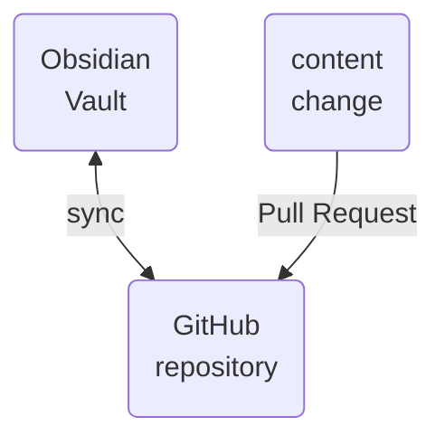

The purpose of this repository is to describe the relationships between various entities in the cloud-native geospatial ecosystem, including:
- software tools, libraries, and services
- data formats
- organizations
 
Obsidian is used to define relationships (with internal links, tags, and properties) and to visualize the relationships through interactive graphs. 

https://github.com/user-attachments/assets/51cf79de-fd2a-4b16-8d4d-5d7ecbf19c12

