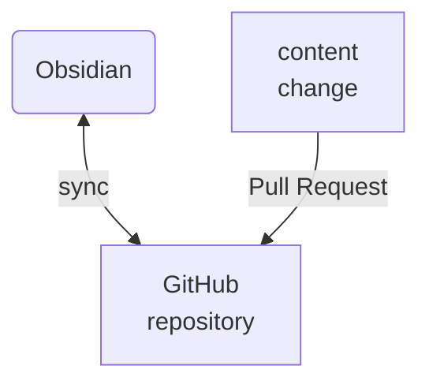

The purpose of this Obsidian Vault is to understand the relationships between: 
- software tools, libraries, and services
- data formats
- organizations

```mermaid
flowchart TD

B(Obsidian) <--> |sync| A[GitHub<br/>repository]

C[content<br/>change] --> |Pull Request| A
```

